<style type="text/css">
.colsel {
background-color: lightyellow;
}
</style>


Recreating (and maybe improving on) some of the figures generated with plot-bamstats application in R.

## Start by making sure packages and data can be loaded and read in.

First load knitr, tidyverse, reshape2 and gridExtra packages.


```{.r .colsel}
library(knitr)
library(tidyverse)
library(reshape2)
library(gridExtra)
```

This document assumes you have the file 'bwa.samtools.stats' in your current working directory, test to make sure it is.

```{.r .colsel}
getwd()
```

```
## [1] "/Users/jli/Jessie/Research/BioInfo/Courses/2019-March-Bioinformatics-Prerequisites/wednesday/Data_in_R"
```

```{.r .colsel}
dir()
```

```
##  [1] "bwa_mem_Stats"             "bwa_mem_Stats.log"        
##  [3] "bwa.samtools.stats"        "bwa.samtools.stats.plot"  
##  [5] "data_in_R_files"           "data_in_R_prepare.md"     
##  [7] "data_in_R_prepare.nb.html" "data_in_R_prepare.Rmd"    
##  [9] "data_in_R.html"            "data_in_R.log"            
## [11] "data_in_R.md"              "data_in_R.nb.html"        
## [13] "data_in_R.Rmd"             "grid_plot.png"
```

```{.r .colsel}
file.exists("bwa.samtools.stats")
```

```
## [1] TRUE
```

If it returned TRUE, great! If not, return to the Prepare data_in_R doc and follow the directions to get the file.

So read in the file and view the first few lines and get the length

```{.r .colsel}
data <- readLines("bwa.samtools.stats")
head(data)
```

```
## [1] "# This file was produced by samtools stats (1.9+htslib-1.9) and can be plotted using plot-bamstats"
## [2] "# This file contains statistics for all reads."                                                    
## [3] "# The command line was:  stats -@ 32 bwa.bam"                                                      
## [4] "# CHK, Checksum\t[2]Read Names\t[3]Sequences\t[4]Qualities"                                        
## [5] "# CHK, CRC32 of reads which passed filtering followed by addition (32bit overflow)"                
## [6] "CHK\t77e64415\t5b47b901\t532fe148"
```

```{.r .colsel}
tail(data)
```

```
## [1] "GCD\t19.0\t58.824\t0.007\t0.007\t0.007\t0.007\t0.007" 
## [2] "GCD\t36.0\t70.588\t0.007\t0.007\t0.007\t0.007\t0.007" 
## [3] "GCD\t38.0\t76.471\t0.007\t0.007\t0.007\t0.007\t0.007" 
## [4] "GCD\t41.0\t82.353\t0.007\t0.007\t0.007\t0.007\t0.007" 
## [5] "GCD\t42.0\t88.235\t0.007\t0.007\t0.007\t0.007\t0.007" 
## [6] "GCD\t48.0\t100.000\t0.007\t0.007\t0.007\t0.007\t0.007"
```

```{.r .colsel}
length(data)
```

```
## [1] 1866
```

There are many sections to the samtools stats output, each section begins with a two or three letter code.

* Summary Numbers -> SN
* First Fragment Qualitites -> FFQ
* Last Fragment Qualitites -> LFQ
* GC Content of first fragments -> GCF
* GC Content of last fragments -> GCL
* ACGT content per cycle -> GCC
* Insert sizes -> IS
* Read lengths -> RL
* Indel distribution -> ID
* Indels per cycle -> IC
* Coverage distribution -> COV
* Coverage distribution -> GCD

With the exception of Summary Numbers, most sections are tables of data, the file explains the format of the 
data tables, open the log file (in Rstudio is fine) and search for the term 'grep'.

Take a quick look at the comments in the file

```{.r .colsel}
head(grep("^# ",data, value=TRUE))
```

```
## [1] "# This file was produced by samtools stats (1.9+htslib-1.9) and can be plotted using plot-bamstats"
## [2] "# This file contains statistics for all reads."                                                    
## [3] "# The command line was:  stats -@ 32 bwa.bam"                                                      
## [4] "# CHK, Checksum\t[2]Read Names\t[3]Sequences\t[4]Qualities"                                        
## [5] "# CHK, CRC32 of reads which passed filtering followed by addition (32bit overflow)"                
## [6] "# Summary Numbers. Use `grep ^SN | cut -f 2-` to extract this part."
```

## First parse out the different sections and save them into different variable (tables).

### Summary table
First extract the Summary numbers and create a summary table

* First extract the right rows, these begin with (^) SN.
* Then turn it into a table using the function separate (View the help of separate)
  * with 3 columns (ID, Name, and Value)
  * separate by the tab character "\\t"
  * and remove the first column '[,-1]', the SN
* Print the table using kable from the knitr package (makes a pretty looking table)


```{.r .colsel}
?separate
```


```{.r .colsel}
sn <- grep("^SN",data, value=TRUE)
sn <- separate(data.frame(sn),col=1, into=c("ID", "Name","Value"), sep="\t")[,-1]
kable(sn, caption="Summary numbers")
```

<table>
<caption>Summary numbers</caption>
 <thead>
  <tr>
   <th style="text-align:left;"> Name </th>
   <th style="text-align:left;"> Value </th>
  </tr>
 </thead>
<tbody>
  <tr>
   <td style="text-align:left;"> raw total sequences: </td>
   <td style="text-align:left;"> 913311962 </td>
  </tr>
  <tr>
   <td style="text-align:left;"> filtered sequences: </td>
   <td style="text-align:left;"> 0 </td>
  </tr>
  <tr>
   <td style="text-align:left;"> sequences: </td>
   <td style="text-align:left;"> 913311962 </td>
  </tr>
  <tr>
   <td style="text-align:left;"> is sorted: </td>
   <td style="text-align:left;"> 0 </td>
  </tr>
  <tr>
   <td style="text-align:left;"> 1st fragments: </td>
   <td style="text-align:left;"> 456655981 </td>
  </tr>
  <tr>
   <td style="text-align:left;"> last fragments: </td>
   <td style="text-align:left;"> 456655981 </td>
  </tr>
  <tr>
   <td style="text-align:left;"> reads mapped: </td>
   <td style="text-align:left;"> 800365919 </td>
  </tr>
  <tr>
   <td style="text-align:left;"> reads mapped and paired: </td>
   <td style="text-align:left;"> 748856756 </td>
  </tr>
  <tr>
   <td style="text-align:left;"> reads unmapped: </td>
   <td style="text-align:left;"> 112946043 </td>
  </tr>
  <tr>
   <td style="text-align:left;"> reads properly paired: </td>
   <td style="text-align:left;"> 306860552 </td>
  </tr>
  <tr>
   <td style="text-align:left;"> reads paired: </td>
   <td style="text-align:left;"> 913311962 </td>
  </tr>
  <tr>
   <td style="text-align:left;"> reads duplicated: </td>
   <td style="text-align:left;"> 0 </td>
  </tr>
  <tr>
   <td style="text-align:left;"> reads MQ0: </td>
   <td style="text-align:left;"> 439677889 </td>
  </tr>
  <tr>
   <td style="text-align:left;"> reads QC failed: </td>
   <td style="text-align:left;"> 0 </td>
  </tr>
  <tr>
   <td style="text-align:left;"> non-primary alignments: </td>
   <td style="text-align:left;"> 290462657 </td>
  </tr>
  <tr>
   <td style="text-align:left;"> total length: </td>
   <td style="text-align:left;"> 127407018699 </td>
  </tr>
  <tr>
   <td style="text-align:left;"> total first fragment length: </td>
   <td style="text-align:left;"> 58451965568 </td>
  </tr>
  <tr>
   <td style="text-align:left;"> total last fragment length: </td>
   <td style="text-align:left;"> 68955053131 </td>
  </tr>
  <tr>
   <td style="text-align:left;"> bases mapped: </td>
   <td style="text-align:left;"> 111789284981 </td>
  </tr>
  <tr>
   <td style="text-align:left;"> bases mapped (cigar): </td>
   <td style="text-align:left;"> 53892754351 </td>
  </tr>
  <tr>
   <td style="text-align:left;"> bases trimmed: </td>
   <td style="text-align:left;"> 0 </td>
  </tr>
  <tr>
   <td style="text-align:left;"> bases duplicated: </td>
   <td style="text-align:left;"> 0 </td>
  </tr>
  <tr>
   <td style="text-align:left;"> mismatches: </td>
   <td style="text-align:left;"> 1041917776 </td>
  </tr>
  <tr>
   <td style="text-align:left;"> error rate: </td>
   <td style="text-align:left;"> 1.933317e-02 </td>
  </tr>
  <tr>
   <td style="text-align:left;"> average length: </td>
   <td style="text-align:left;"> 139 </td>
  </tr>
  <tr>
   <td style="text-align:left;"> average first fragment length: </td>
   <td style="text-align:left;"> 128 </td>
  </tr>
  <tr>
   <td style="text-align:left;"> average last fragment length: </td>
   <td style="text-align:left;"> 151 </td>
  </tr>
  <tr>
   <td style="text-align:left;"> maximum length: </td>
   <td style="text-align:left;"> 151 </td>
  </tr>
  <tr>
   <td style="text-align:left;"> maximum first fragment length: </td>
   <td style="text-align:left;"> 128 </td>
  </tr>
  <tr>
   <td style="text-align:left;"> maximum last fragment length: </td>
   <td style="text-align:left;"> 151 </td>
  </tr>
  <tr>
   <td style="text-align:left;"> average quality: </td>
   <td style="text-align:left;"> 26.6 </td>
  </tr>
  <tr>
   <td style="text-align:left;"> insert size average: </td>
   <td style="text-align:left;"> 176.9 </td>
  </tr>
  <tr>
   <td style="text-align:left;"> insert size standard deviation: </td>
   <td style="text-align:left;"> 132.5 </td>
  </tr>
  <tr>
   <td style="text-align:left;"> inward oriented pairs: </td>
   <td style="text-align:left;"> 122015428 </td>
  </tr>
  <tr>
   <td style="text-align:left;"> outward oriented pairs: </td>
   <td style="text-align:left;"> 32504015 </td>
  </tr>
  <tr>
   <td style="text-align:left;"> pairs with other orientation: </td>
   <td style="text-align:left;"> 4311328 </td>
  </tr>
  <tr>
   <td style="text-align:left;"> pairs on different chromosomes: </td>
   <td style="text-align:left;"> 215597607 </td>
  </tr>
  <tr>
   <td style="text-align:left;"> percentage of properly paired reads (%): </td>
   <td style="text-align:left;"> 33.6 </td>
  </tr>
</tbody>
</table>


```{.r .colsel}
?kable
```

**<font color='blue'>Exercise 1: While the Value column is numeric, by default it is being read in as characters. Use kable align parameter to left justify name and right justify value.</font>**   


### Get the next section, read lengths

First extract the read length data and create a table

* First extract the right rows, these begin (^) with RL.
* Then turn it into a table using the function separate (View the help of separate)
  * with 6 columns (ID, insert size, pairs total, inward oriented pairs, outward oriented pairs, other pairs)
  * separate by the tab character "\\t"
  * and remove the first column '[,-1]', the IS


```{.r .colsel}
rl <- grep("^RL",data, value=TRUE)
rl <- separate(data.frame(rl),col=1, into=c("ID", "read_length", "count"), sep="\t", convert = TRUE)[,-1]
```

### Get the insert size of mapped pairs

First extract the insert sizes data and create a table

* First extract the right rows, these begin (^) with IS.
* Then turn it into a table using the function separate (View the help of separate)
  * with 6 columns (ID, insert size, pairs total, inward oriented pairs, outward oriented pairs, other pairs)
  * separate by the tab character "\\t"
  * and remove the first column '[,-1]', the IS


```{.r .colsel}
is <- grep("^IS",data, value=TRUE)
is <- separate(data.frame(is),col=1, into=c("ID", "insert size","all pairs", "inward", "outward", "other"), sep="\t", convert=TRUE)[,-1]
```

### Get the ACGT content per cycle

First extract the base composition of first and last pairs and create a table

* First extract the right rows, these begin (^) with GCC.
* Then turn it into a table using the function separate (View the help of separate)
  * with 6 columns (ID, insert size, pairs total, inward oriented pairs, outward oriented pairs, other pairs)
  * separate by the tab character "\\t"
  * and remove the first column '[,-1]', the GCC


```{.r .colsel}
actg <- grep("^GCC",data, value=TRUE)
actg <- separate(data.frame(actg),col=1, into=c("ID", "cycle", "A", "C", "G", "T", "N", "O"), sep="\t",  convert=TRUE)[,-1]
```

### Get the fragment qualities of mapped pairs

First extract the fragment qualities of first and last pairs and create a table

* First extract the right rows, these begin (^) with FFQ or LFQ.
* Then turn it into a table using the function separate (View the help of separate)
  * with 3 columns (Pair, Cycle, 1 ... 43)
  * separate by the tab character "\\t"


```{.r .colsel}
fq <- grep("^FFQ|^LFQ",data, value=TRUE)
fq <- separate(data.frame(fq),col=1, into=c("Pair", "Cycle", seq(41)), sep="\t", convert=TRUE)
```

```
## Warning: Expected 43 pieces. Missing pieces filled with `NA` in 279
## rows [1, 2, 3, 4, 5, 6, 7, 8, 9, 10, 11, 12, 13, 14, 15, 16, 17, 18, 19,
## 20, ...].
```

We get a message here, saying data is missing. This is because there are no 38,39,40,41 quality scores (the typical range for Illumina qualities).

### Get the GC content of mapped pairs

First extract the GC content of first and last pairs and create a table

* First extract the right rows, these begin (^) with GCF or GCL.
* Then turn it into a table using the function separate (View the help of separate)
  * with 3 columns (Pair, GC, Count)
  * separate by the tab character "\\t"


```{.r .colsel}
gc <- grep("^GCF|^GCL",data, value=TRUE)
gc <- separate(data.frame(gc),col=1, into=c("Pair", "GC", "Count"), sep="\t", convert=TRUE)
```

### Get the Indel Distribution

First extract the indel distribution data and create a table

* First extract the right rows, these begin (^) with ID.
* Then turn it into a table using the function separate (View the help of separate)
  * with 4 columns (ID, length, insertion_count, deletion_count)
  * separate by the tab character "\\t"
  * and remove the first column '[,-1]', the ID


```{.r .colsel}
id <- grep("^ID",data, value=TRUE)
id <- separate(data.frame(id),col=1, into=c("ID", "length", "insertion_count", "deletion_count"), sep="\t", covert=TRUE)[,-1]
```

### Get the Indel per cycle

First extract the indel by cycle data and create a table

* First extract the right rows, these begin (^) with IC.
* Then turn it into a table using the function separate (View the help of separate)
  * with 6 columns (ID, cycle, ins_fwd, ins_rev, del_fwd, del_rev)
  * separate by the tab character "\\t"
  * and remove the first column '[,-1]', the IC


```{.r .colsel}
ic <- grep("^IC",data, value=TRUE)
ic <- separate(data.frame(ic),col=1, into=c("ID", "cycle", "ins_fwd", "ins_rev", "del_fwd", "del_rev"), sep="\t", convert=TRUE)[,-1]
```

### Get the coverage data and GC Coverage data

**<font color='blue'>Exercise 2: Use what you learned above to extract these 2 sections from the file.</font>**   

***Coverage data***

* First extract the right rows, these begin (^) with IS.
* Then turn it into a table using the function separate (View the help of separate)
  * with 6 columns (ID, coverage_range, coverage, bases)
  * separate by the tab character "\\t"
  * and remove the first column '[,-1]', the COV

***GC Coverage data***

* First extract the right rows, these begin (^) with GCD.
* Then turn it into a table using the function separate (View the help of separate)
  * with 8 columns (ID, GC, GC_percentile, gc.10, gc.25, gc.50, gc.75, gc.90)
  * separate by the tab character "\\t"
  * and remove the first column '[,-1]', the GCD   

### Some Summary stats with 


```{.r .colsel}
summarize(is,low=min(`insert size`), max=max(`insert size`), average=mean(`all pairs`), noutward=sum(outward), ninward=sum(inward))
```

```
##   low max average noutward   ninward
## 1   0 576  272522 32273430 120770240
```

```{.r .colsel}
new_is <- mutate(is,poutward=outward/`all pairs`, pinward=inward/`all pairs`)
```


**<font color='blue'>Exercise 3: Try using "distinct", on is (or new_is) on the outward and inward columns.</font>**   

**<font color='blue'>Exercise 4:</font>**

1. **<font color='blue'>View the head/tail of some (or even all) of the objects.</font>**

2. **<font color='blue'>Use dim to get an idea of the table dimentions.</font>**

3. **<font color='blue'>Use summary to summarize and produce summary statistics (min, max, means, 1st and 3rd quartile boundaries) of the columns.</font>**

4. **<font color='blue'>Any other summaries?</font>**   

   
So now we have new objects (data.frames) that hold the data that we are interested in plotting

* Summary Numbers -> SN -> sn
* First Fragment Qualitites -> FFQ -> fq
* Last Fragment Qualitites -> LFQ -> fq
* GC Content of first fragments -> GCF -> gc
* GC Content of last fragments -> GCL -> gc
* ACGT content per cycle -> GCC -> actg
* Insert sizes -> IS -> is
* Read lengths -> RL -> rl
* Indel distribution -> ID -> id
* Indels per cycle -> IC -> ic
* Coverage distribution -> COV -> cov
* Coverage distribution -> GCD -> gccov

---
    

## Introduction to ggplot2

ggplot2 uses a basic syntax framework (called a Grammar in ggplot2) for all plot types:

A basic ggplot2 plot consists of the following components:

* data in the form of a data frame
* aesthetics: How your data are represented
  * x, y, color, size, shape
* geometry: Geometries of the plotted objects
  * points, lines, bars, etc.
* Addition plotting componants
  * statistical transformations
  * scales
  * coordinate system
  * position adjustments
  * faceting

The basic idea: independently specify plot layers and combine them (using '+') to create just about any kind of graphical display you want.

ggplot (data = \<DATA\> ) +   
  \<GEOM_FUNCTION\> (mapping = aes( \<MAPPINGS\> ), stat = \<STAT\> , position = \<POSITION\> ) +    
  \<COORDINATE_FUNCTION\> +    
  \<FACET_FUNCTION\> +    
  \<SCALE_FUNCTION\> +    
  \<THEME_FUNCTION\>   

### Our first plot, plotting the insert size of mapped fragments

We use the ggplot function and define the data as 'is' and x, y as get("insert size"), get("all pairs"), respectively. We use "get" because they have spaces in the names. There is another way to do it. Hint: look at the documentation above for clues.


```{.r .colsel}
g <- ggplot(data = is)
g + geom_line( aes(x=get("insert size"), y=get("all pairs")))
```

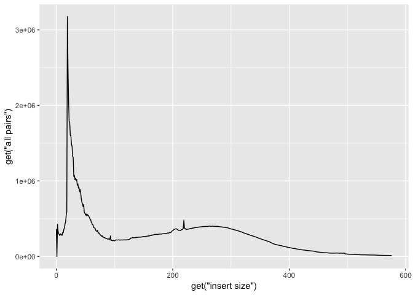<!-- -->


Ok, now add some labels to the plot


```{.r .colsel}
g + geom_line( aes(x=get("insert size"), y=get("all pairs"))) + 
  labs( x = "insert size", y = "all pairs", title ="Mapped insert sizes", subtitle = "All Pairs", caption = "all pairs insert size")
```

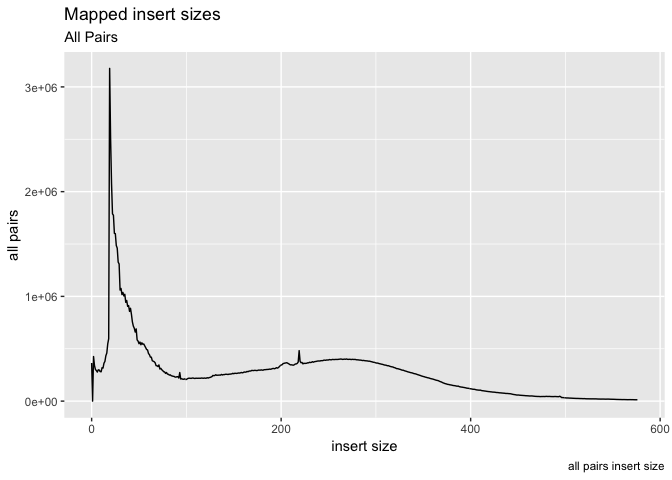<!-- -->

Ok, what about plotting multiple data objects on the same plot (multiple lines)? We can specifically set the y axis in geom_line and color, then call geom_lines a second time (or more times).


```{.r .colsel}
g <- ggplot(data = is, aes(x=get("insert size")))
g + geom_line(aes(y=get("inward")),color="blue") +  
    geom_line(aes(y=get("outward")),color="orange") + 
    labs( x = "insert size", y = "all pairs", title ="Mapped insert sizes", subtitle = "All Pairs", caption = "all pairs insert size")
```

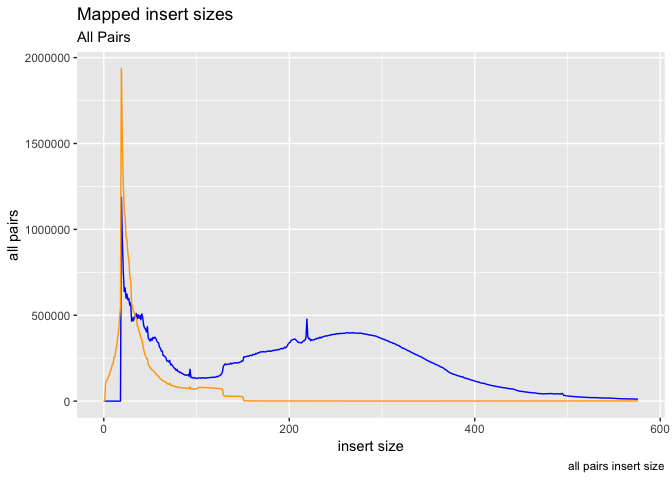<!-- -->

try adjusting the x/y limits to 0,600 and 0,20000 respectively.


```{.r .colsel}
g + geom_line(aes(y=get("inward")),color="blue") +
  geom_line(aes(y=get("outward")),color="orange") + 
  coord_cartesian(xlim=c(0,500), ylim=c(0,600000))
```

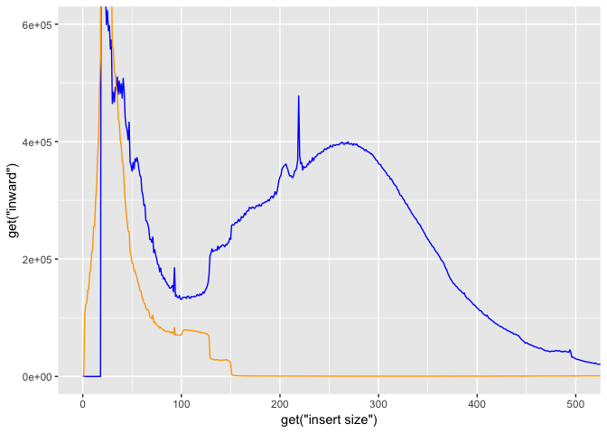<!-- -->

Ok so now put all these elements together into a single plot, save final plot as 'g'   


```{.r .colsel}
g <- ggplot(data = is, aes(x=get("insert size")))
g <- g + geom_line(aes(y=get("all pairs")), color="black") +  
    geom_line(aes(y=get("inward")),color="blue") +  
    geom_line(aes(y=get("outward")),color="orange") +
    geom_line(aes(y=get("other")), color="green")
g <- g + 
    labs( x = "insert size", y = "all pairs", title ="Mapped insert sizes", subtitle = "All Pairs", caption = "all pairs insert size")
g <- g + coord_cartesian(xlim=c(0,500), ylim=c(0,600000))
g <- g + theme_light()
plot(g)
```

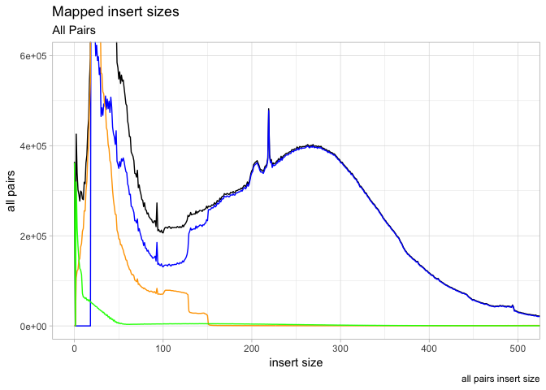<!-- -->

**<font color='blue'>Exercise 5: Put it all together, plot all four columns of the insert size data object, add in legends, reasonable coordinate limits.</font>**   


**<font color='blue'>Exercise 6: Play with ggplot2 themes (ex. theme_classic() )</font>**   


### Plotting GC content

In order to plot GC percentage we first need to convert the counts to proportions, to do so we can divide the counts by the sum of counts.


```{.r .colsel}
head(gc)
```

```
##   Pair   GC Count
## 1  GCF 0.25  9986
## 2  GCF 1.01  6442
## 3  GCF 1.76  6816
## 4  GCF 2.51  8029
## 5  GCF 3.27  9586
## 6  GCF 4.02 11557
```

```{.r .colsel}
h <- ggplot(gc, aes(GC, Count/sum(Count),color=Pair))
h <- h + geom_line()
h
```

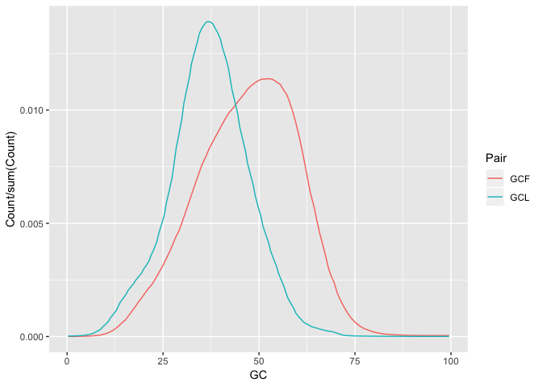<!-- -->

**<font color='blue'>Exercise 7: Finish the plot (add labels, etc.). Save the final graph object in h.</font>**   


### Plotting the base composition by cycle

Sometimes we may need to transform our data before plotting. The melt funciton from reshape2 takes data in wide format (data are in columns) and stacks a set of columns into a single column of data. In the ACTG object we can stack bases values by cycle.


```{.r .colsel}
actgm <- melt(actg,id="cycle")
```

now head the new actgm object. What did melt do?


```{.r .colsel}
ic <- ggplot(actgm, aes(cycle, value, by=variable, colour=variable))
i <- ic + geom_line() + coord_cartesian(ylim=c(0,100))
i
```

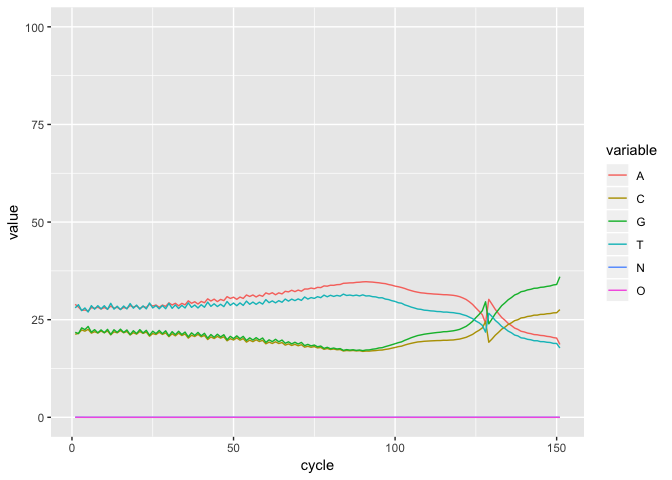<!-- -->

**<font color='blue'>Exercise 8: Using what you have learned so far, finish the plot, save it as object i.</font>**   


### A boxplot of basepair


```{.r .colsel}
i2 <- ic + geom_boxplot()
i2
```

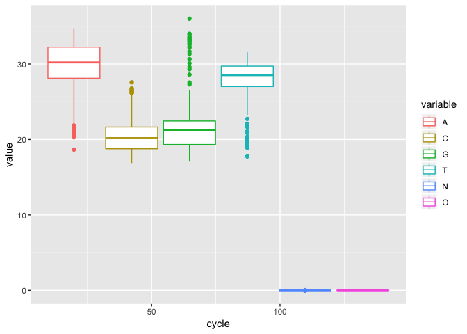<!-- -->

**<font color='blue'>Exercise 9: Try some other geometries (Ex. bin2d, col, count, which generate an 'interpretable' plot).</font>**   


### Plotting a heatmap of qualities

First melt the quality scores


```{.r .colsel}
fqm <- melt(fq,id=c("Pair","Cycle"))
```

Take a look at the new object


```{.r .colsel}
j <- ggplot(fqm, aes(Cycle, variable)) 
j + geom_tile(aes(fill = as.numeric(value)))
```

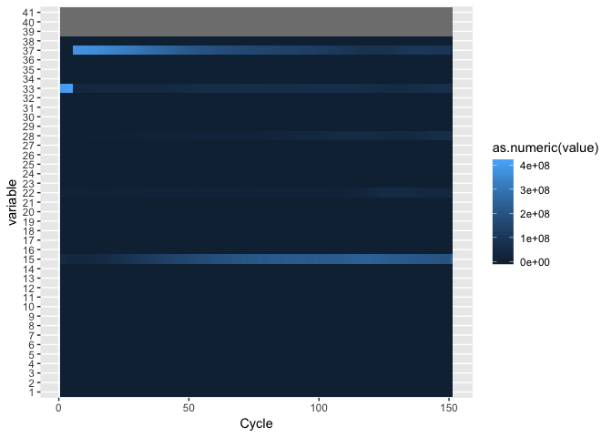<!-- -->

Now try changing the gradient colors and modify the legend, add labels. The ggplot2 'theme' function can be used to modify individual components of a theme.


```{.r .colsel}
?theme
```


```{.r .colsel}
j = j + geom_tile(aes(fill = as.numeric(value))) + 
  scale_fill_gradient(low = "red", high = "green") +
  ylab("Cycle") +
  xlab("Quality") +
  theme(legend.title = element_text(size = 10),
        legend.text = element_text(size = 12),
        plot.title = element_text(size=16),
        axis.title=element_text(size=14,face="bold"),
        axis.text.x = element_text(angle = 90, hjust = 1)) +
  labs(fill = "Quality value")
j
```

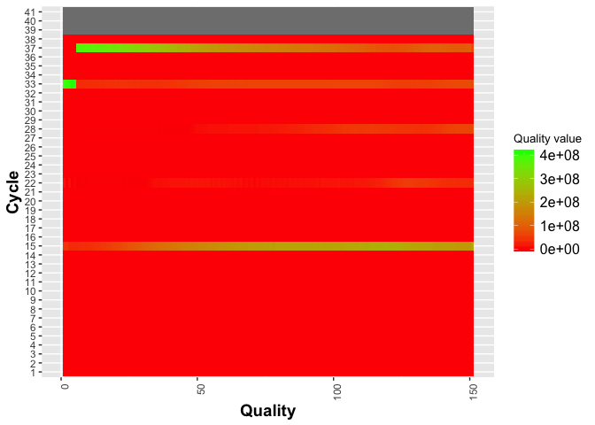<!-- -->

**<font color='blue'>Exercise 10: Try modifying scale_fill_gradient to scale_fill_distiller.</font>**   


**<font color='blue'>Exercise 11: Play with parts of the plotting function, see how the change modifies the plot.</font>**   


### Plotting indel lengths


```{.r .colsel}
k <- ggplot(id, aes(x=as.numeric(length)))
k <- k + geom_line(aes(y=as.numeric(insertion_count)), color = "red", size=1.5)
k <- k + geom_line(aes(y=as.numeric(deletion_count)), color = "black", size=1.5)
k
```

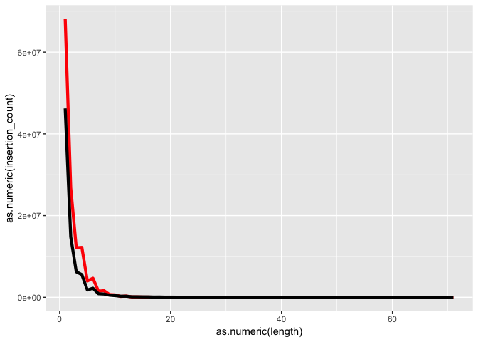<!-- -->

Try changing the Y axis to log scale

```{.r .colsel}
k <- k + scale_y_log10()
k
```

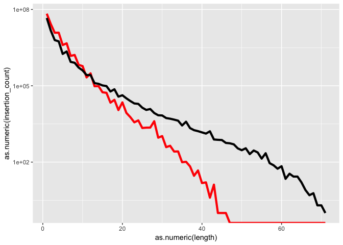<!-- -->

Tweak the grid elments using theme

```{.r .colsel}
k <- k + theme(panel.grid.minor = element_blank(), 
  panel.grid.major = element_line(color = "gray50", size = 0.5),
  panel.grid.major.x = element_blank())
k
```

```
## Warning: Transformation introduced infinite values in continuous y-axis
```

<!-- -->

## update the axis labels

```{.r .colsel}
k <- k + xlab("indel length") + ylab("indel count (log10)")
k
```

```
## Warning: Transformation introduced infinite values in continuous y-axis
```

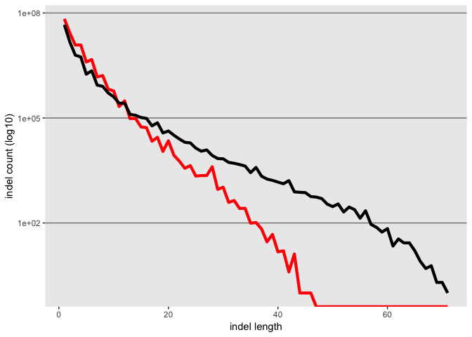<!-- -->

Now also plot the ratio of the 2, but first we need to create the ratio data


```{.r .colsel}
id$ratio <- as.numeric(id$insertion_count)/as.numeric(id$deletion_count)
l <- ggplot(id, aes(x=as.numeric(length)))
l <- l + geom_line(aes(y=as.numeric(ratio)), color = "green", size=1.0)
l
```

<!-- -->

Tweak the grid

```{.r .colsel}
l <- l + theme(panel.grid.minor = element_blank(), 
  panel.grid.major = element_line(color = "gray50", size = 0.5),
  panel.grid.major.x = element_blank())
l
```

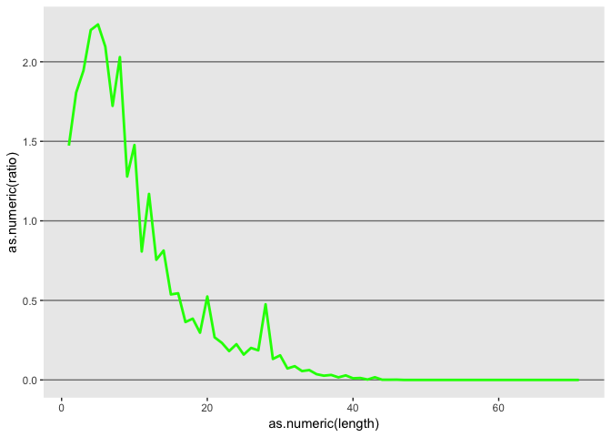<!-- -->

Update axis labels

```{.r .colsel}
l <- l + xlab("indel length") + ylab("insertion/deletion ratio")
l
```

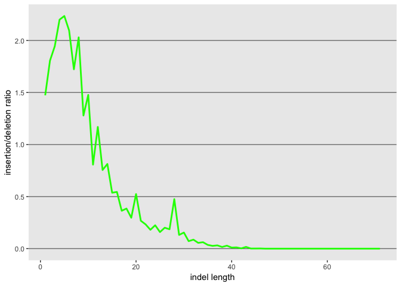<!-- -->

Now use gridExtra to plot both in the same plat

```{.r .colsel}
grid.arrange(k, l, nrow = 1)
```

```
## Warning: Transformation introduced infinite values in continuous y-axis
```

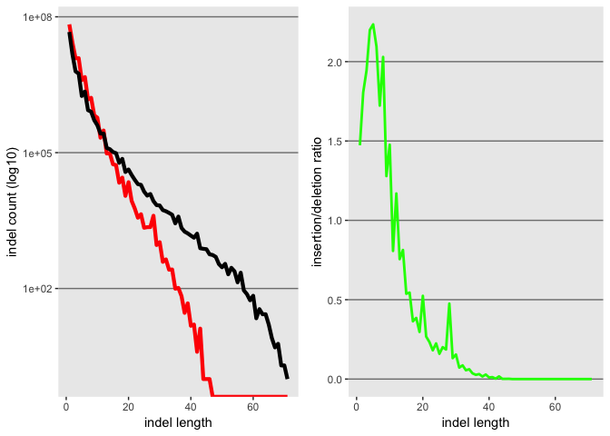<!-- -->

### Fancy Multiple plots in a grid
The gridExtra package is great for plotting multiple object in one plot.


```{.r .colsel}
include_graphics("https://raw.githubusercontent.com/ucdavis-bioinformatics-training/2018-September-Bioinformatics-Prerequisites/master/thursday/Data_in_R/grid_plot.png")
```

<!-- -->


```{.r .colsel}
full <- grid.arrange(
  g, h, i, i2, 
  widths = c(2, 1, 1),
  layout_matrix = rbind(c(1, 2, NA),
                        c(3, 3, 4))
)
```

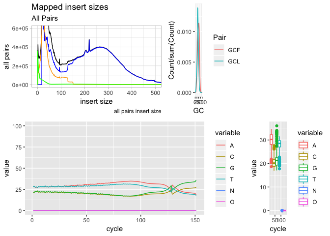<!-- -->

**<font color='blue'>Exercise 12: Play with th grid.arrange function, using the plots you've created to create you own final combined plot.</font>**   


### Saving plots as png or pdf

This might have to be done outside of the Notebook as the notebook may expect you to plot in the notebook only, so run on the Console if you have trouble running in the Notebook.

Saving plots to pdf ** do on the console if having trouble in Notebook **

```{.r .colsel}
ggsave("multi_plot.pdf",full,device="pdf",width=6,height=4, units="in", dpi=300)
```

Saving plots to png  ** do on the console if having trouble in Notebook **

```{.r .colsel}
ggsave("multi_plot.png",full,device="png",width=6,height=4, units="in", dpi=300)
```

View the help documentation for ggsave, what other 

With any remaining time (or homework), use the ggplot cheat sheet to further expand and modify the plots.

## ggplot2 book by its author, Hadley Wickham

[book in PDF form](http://moderngraphics11.pbworks.com/f/ggplot2-Book09hWickham.pdf)

[book on GitHub](https://github.com/hadley/ggplot2-book)

Its always good to end any Notebook with Session info, records all the packages loaded and their versions


```{.r .colsel}
sessionInfo()
```

```
## R version 3.5.1 (2018-07-02)
## Platform: x86_64-apple-darwin15.6.0 (64-bit)
## Running under: macOS High Sierra 10.13.6
## 
## Matrix products: default
## BLAS: /Library/Frameworks/R.framework/Versions/3.5/Resources/lib/libRblas.0.dylib
## LAPACK: /Library/Frameworks/R.framework/Versions/3.5/Resources/lib/libRlapack.dylib
## 
## locale:
## [1] en_US.UTF-8/en_US.UTF-8/en_US.UTF-8/C/en_US.UTF-8/en_US.UTF-8
## 
## attached base packages:
## [1] stats     graphics  grDevices utils     datasets  methods   base     
## 
## other attached packages:
##  [1] bindrcpp_0.2.2       gridExtra_2.3        reshape2_1.4.3      
##  [4] forcats_0.4.0        stringr_1.3.1        dplyr_0.7.7         
##  [7] purrr_0.2.5          readr_1.3.1          tidyr_0.8.2         
## [10] tibble_1.4.2         ggplot2_3.1.0        tidyverse_1.2.1     
## [13] kableExtra_1.0.1     usethis_1.4.0        devtools_2.0.1      
## [16] BiocInstaller_1.30.0 knitr_1.20           rmarkdown_1.10      
## 
## loaded via a namespace (and not attached):
##  [1] httr_1.3.1        pkgload_1.0.2     jsonlite_1.5     
##  [4] viridisLite_0.3.0 modelr_0.1.4      assertthat_0.2.0 
##  [7] highr_0.7         cellranger_1.1.0  yaml_2.2.0       
## [10] remotes_2.0.2     sessioninfo_1.1.0 pillar_1.3.0     
## [13] backports_1.1.2   lattice_0.20-35   glue_1.3.0       
## [16] digest_0.6.18     rvest_0.3.2       colorspace_1.3-2 
## [19] htmltools_0.3.6   plyr_1.8.4        pkgconfig_2.0.2  
## [22] broom_0.5.1       haven_2.1.0       scales_1.0.0     
## [25] webshot_0.5.1     processx_3.2.0    generics_0.0.2   
## [28] withr_2.1.2       lazyeval_0.2.1    cli_1.0.1        
## [31] magrittr_1.5      crayon_1.3.4      readxl_1.3.1     
## [34] memoise_1.1.0     evaluate_0.12     ps_1.2.0         
## [37] fs_1.2.6          nlme_3.1-137      xml2_1.2.0       
## [40] pkgbuild_1.0.2    tools_3.5.1       prettyunits_1.0.2
## [43] hms_0.4.2         munsell_0.5.0     callr_3.0.0      
## [46] compiler_3.5.1    rlang_0.3.0.1     grid_3.5.1       
## [49] rstudioapi_0.8    base64enc_0.1-3   labeling_0.3     
## [52] gtable_0.2.0      curl_3.2          R6_2.3.0         
## [55] lubridate_1.7.4   bindr_0.1.1       rprojroot_1.3-2  
## [58] desc_1.2.0        stringi_1.2.4     Rcpp_0.12.19     
## [61] tidyselect_0.2.5
```
